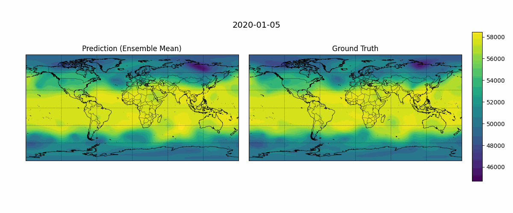

# Real-data Weather Inference with GeoArches/ArchesWeatherGen — Z500 GIF on ERA5 *(Apptainer, ≤5GB demo)*

This tutorial demonstrates **inference on real weather data** using AMD's **GeoArches** framework with the **ArchesWeatherGen** generative model. Instead of Docker, this classroom version uses **Apptainer** for portable, reproducible GPU containers.

## What is ArchesWeatherGen?

**ArchesWeatherGen** is a **diffusion-based generative weather model** developed by AMD/INRIA. It builds on top of deterministic weather models (ArchesWeather) to produce **probabilistic forecasts** through ensemble generation.

### Key properties:
- **Model type**: Conditional diffusion model for weather forecasting
- **Input**: Initial conditions from ERA5 reanalysis (previous state + deterministic forecast)
- **Output**: Ensemble of future weather states (probabilistic forecast)
- **Variables**: 6 atmospheric levels × 13 pressure levels + 4 surface variables
- **Resolution**: 240×121 (equiangular, ~1.5°)
- **Lead time**: 24-hour steps, up to 10 days rollout

### Why it's useful:
1. **Uncertainty quantification** — Ensemble spread shows forecast confidence
2. **Extreme event prediction** — Better captures tail risks than deterministic models
3. **Downscaling** — Generates high-resolution details from coarse inputs
4. **Research platform** — Open-source, extensible for new variables/tasks

## What this tutorial teaches

| Skill | Description |
|-------|-------------|
| **GPU containerization** | Build portable Apptainer images for ROCm (AMD) and CUDA (NVIDIA) |
| **Real-data inference** | Load pretrained weights, run multi-step rollout on ERA5 |
| **Ensemble forecasting** | Generate multiple members → compute ensemble mean |
| **Data management** | Handle large datasets (ERA5) with size constraints (≤5GB) |
| **Visualization** | Create animated GIFs comparing prediction vs ground truth |

## Output example

The script produces a GIF comparing **ensemble mean prediction** vs **ERA5 ground truth** for **Z500** (500 hPa geopotential height):



*Figure: Ensemble mean prediction (left) vs ERA5 ground truth (right) for Z500 on 3 successive 24-hour rollout steps.*

Each frame shows:
- **Left**: Model prediction (ensemble mean of N members)
- **Right**: Ground truth from ERA5 reanalysis
- **Colorbar**: Geopotential height in meters (shared scale)

---

## Folder structure

```
04-geoarches/
├── geoarches_rocm.def      # ROCm/AMD container definition
├── geoarches_cuda.def   # CUDA/NVIDIA container definition
├── build_rocm_container.sh     # Build ROCm image
├── build_cuda_container.sh  # Build CUDA image
├── run_z500_gif.sh   # Main inference wrapper
├── submit_z500_gif.sh # SLURM submission script
├── run_inference.py                      # Inference + visualization script
├── data_small/                           # Optional tiny test data
└── Z500_example.gif                      # Example output GIF
```

---

## Quick start (build + run)

### 1. Build the container (once)

**For AMD/ROCm (MI300X, etc.):**
```bash
cd 03-inference/04-geoarches
./build_rocm_container.sh pytorch_training_geoarches.sif
```

**For NVIDIA/CUDA (RTX, A100, etc.):**
```bash
cd 03-inference/04-geoarches
./build_cuda_container.sh pytorch_training_geoarches_nv.sif
```

> **Build tip:** Images are large (~4-11GB). If `/tmp` is small, set a larger temp directory:
> ```bash
> export APPTAINER_TMPDIR=/scratch/$USER/apptmp
> ```

### 2. Run inference (generates the GIF)

The wrapper script handles downloads and execution. Key environment variables:

| Variable | Default | Description |
|----------|---------|-------------|
| `SIF_NAME` | `pytorch_training_geoarches.sif` | Container image to use |
| `RUN_DIR` | `$PWD/geoarches_real` | Output directory on host |
| `MODEL_NAME` | `archesweathergen` | HuggingFace model identifier |
| `ROLLOUT_ITERATIONS` | `10` | Number of 24h forecast steps |
| `N_MEMBERS` | `25` | Ensemble size |
| `DOWNLOAD_DATA` | `0` | Download ERA5 subset (1 = yes) |
| `DOWNLOAD_MODELS` | `0` | Download model checkpoints (1 = yes) |
| `DOWNLOAD_ASSETS` | `0` | Download normalization stats (1 = yes). Required stats are also auto-fetched if missing. |
| `MAX_DATA_GB` | `5` | Max ERA5 data to download |
| `RUN_YEARS_STR` | `2020` | Years to download (space-separated) |
| `RUN_HOURS_STR` | `0` | Hours to download (space-separated) |

**Minimal test (fast wiring check):**
```bash
RUN_INFER=0 DOWNLOAD_DATA=0 DOWNLOAD_MODELS=0 DOWNLOAD_ASSETS=0 \
  ./run_z500_gif.sh
```

Note: the wrapper may still download the **required** GeoArches normalization/statistics files if they are missing in your `RUN_DIR` (it caches them afterward).

**Full run (downloads everything, generates GIF):**
```bash
# ROCm (auto-detected on AMD GPUs)
DOWNLOAD_DATA=1 DOWNLOAD_MODELS=1 DOWNLOAD_ASSETS=1 \
  ./run_z500_gif.sh

# CUDA (force NVIDIA mode)
export SIF_NAME=pytorch_training_geoarches_nv.sif
export APPTAINER_USE_NV=1
DOWNLOAD_DATA=1 DOWNLOAD_MODELS=1 DOWNLOAD_ASSETS=1 \
  ./run_z500_gif.sh
```

**SLURM submission (for clusters):**
```bash
sbatch \
  --export=ALL,\
    RUN_DIR=/scratch/$USER/geoarches_real,\
    DOWNLOAD_DATA=1,\
    DOWNLOAD_MODELS=1,\
    DOWNLOAD_ASSETS=1,\
    RUN_YEARS_STR='2020',\
    RUN_HOURS_STR='0',\
    MAX_DATA_GB=5,\
    MODEL_NAME=archesweathergen,\
    ROLLOUT_ITERATIONS=10,\
    N_MEMBERS=25 \
  submit_z500_gif.sh
```

### 3. Check output
```bash
ls $RUN_DIR/gifs/Z500.gif
```

---

## Inference code deep dive (`run_inference.py`)

The core inference logic is in **`run_inference.py`**. Here's a detailed breakdown of each component:

### Command-line interface
```python
parser = argparse.ArgumentParser()
parser.add_argument("--model", type=str, required=True)          # Path to modelstore/archesweathergen
parser.add_argument("--data-path", type=str, required=True)      # Path to ERA5 data directory
parser.add_argument("--output-dir", type=str, required=True)     # Where to save Z500.gif
parser.add_argument("--rollout-iterations", type=int, default=10) # Forecast steps (24h each)
parser.add_argument("--n-members", type=int, default=5)          # Ensemble size
parser.add_argument("--cmap", type=str, default="viridis")       # Matplotlib colormap
```
All key parameters are configurable via CLI — no hardcoding.

---

### 1. Device setup & model loading
```python
torch.set_grad_enabled(False)
device = "cuda" if torch.cuda.is_available() else "cpu"

gen_model, _ = load_module(args.model)
gen_model = gen_model.to(device)
```
- **Disables gradients** for inference (memory + speed)
- **Auto-detects GPU** (CUDA on NVIDIA, ROCm on AMD)
- **`load_module()`** loads the full ArchesWeatherGen pipeline:
  - The generative diffusion model (`archesweathergen`)
  - 4 deterministic sub-models referenced in its config:
    - `archesweather-m-seed0`, `archesweather-m-seed1` (mean models)
    - `archesweather-m-skip-seed0`, `archesweather-m-skip-seed1` (skip-connection models)

---

### 2. ERA5 dataset initialization
```python
ds = Era5Forecast(
    path=args.data_path,
    load_prev=True,           # Load previous timestep as conditioning
    norm_scheme="pangu",      # Pangu-Weather normalization stats
    domain="test",            # Use test split (not train/val)
)
```
- **`Era5Forecast`** reads NetCDF files from WeatherBench2 ERA5 dataset
- **`load_prev=True`** provides the previous state as input (required for rollout)
- **`norm_scheme="pangu"`** applies the same normalization the model was trained with
- **`domain="test"`** selects the held-out test period (avoids data leakage)

---

### 3. Prepare initial conditions batch
```python
batch = {k: v[None].to(device) for k, v in ds[0].items()}
```
- Takes the **first sample** from the dataset (initial time step)
- Adds batch dimension (`[None]`) → shape becomes `(1, C, H, W)`
- Moves to GPU for inference

---

### 4. Ensemble rollout generation (core inference)
```python
rollouts = []
for member in range(args.n_members):
    r = gen_model.sample_rollout(
        batch,
        batch_nb=0,
        member=member,                    # Different random seed per member
        iterations=args.rollout_iterations,
    ).cpu()
    r = ds.denormalize(r)                 # Convert from normalized → physical units
    rollouts.append(r["level"][0])        # Extract level variables (drop surface)

ensemble_mean = torch.stack(rollouts, dim=0).mean(dim=0)
```
**This is the heart of probabilistic forecasting:**
- Loops `n_members` times with **different random seeds** (`member` index)
- Each call to `sample_rollout()` produces a full trajectory: `(T, C, H, W)`
- **`denormalize()`** converts model output back to physical units (e.g., geopotential in m²/s²)
- **`r["level"][0]`** selects the first batch item, all 13 pressure levels × 6 variables
- **`torch.stack(...).mean(dim=0)`** computes the **ensemble mean** across members

> **Why ensemble?** Single diffusion samples are stochastic. The mean reduces noise; the spread quantifies uncertainty.

---

### 5. Ground-truth alignment (the "limited" adaptation)
```python
def infer_gt_index_step(ds, lead_time_hours: int = 24) -> int:
    t0 = int(ds[0]["timestamp"].item())
    t1 = int(ds[1]["timestamp"].item())
    delta_s = t1 - t0
    if delta_s <= 0:
        return 4
    lead_s = int(lead_time_hours * 3600)
    step = int(round(lead_s / float(delta_s)))
    return max(1, step)

lead_time_hours = 24
idx_step = infer_gt_index_step(ds, lead_time_hours=lead_time_hours)

gt_denormalized = []
for step_i in range(args.rollout_iterations):
    idx = step_i * idx_step
    if idx >= len(ds):
        raise RuntimeError(...)
    gt_sample = ds[idx]
    gt_denorm = ds.denormalize(gt_sample["state"])
    gt_field = gt_denorm["level"][0, 7]   # Z500 = level index 7 (500 hPa)
    ts_str = datetime.fromtimestamp(int(gt_sample["timestamp"]), timezone.utc).date().isoformat()
    gt_denormalized.append((gt_field, ts_str))
```
**Problem:** The original blog assumes ERA5 6-hourly data (so +24h = 4 indices). But we download only **hour 0** to stay under 5GB → data has 24h spacing!

**Solution:** `infer_gt_index_step()` measures actual timestamp delta between consecutive samples and computes the correct index step. Works for any subset cadence.

- **`ds[i]["timestamp"]`** = Unix timestamp (seconds) of sample `i`
- **`level[0, 7]`** = Z500 (500 hPa geopotential), the standard mid-troposphere diagnostic
- **`ts_str`** = Date string for frame titles (e.g., "2020-01-01")

---

### 6. Shared colorbar limits
```python
model_min = float(ensemble_mean[:, 0, 7].min().item())
model_max = float(ensemble_mean[:, 0, 7].max().item())
gt_min = min(gt_field.min().item() for gt_field, _ in gt_denormalized)
gt_max = max(gt_field.max().item() for gt_field, _ in gt_denormalized)

colorbar_min = min(model_min, gt_min)
colorbar_max = max(model_max, gt_max)
```
- Computes **global min/max** across both prediction and ground truth
- Ensures **same color scale** on both panels for fair visual comparison
- Uses Z500 channel (index 7) from both model output and GT

---

### 7. Frame rendering & GIF creation
```python
def plot_frame(pred, gt, ts_str, cmap, vmin, vmax):
    fig, axes = plt.subplots(1, 2, figsize=(12, 5), subplot_kw={"projection": ccrs.PlateCarree()})
    # ... cartopy styling (coastlines, borders, gridlines) ...
    im = ax.imshow(field, cmap=cmap, vmin=vmin, vmax=vmax, transform=ccrs.PlateCarree(),
                   extent=[0, 360, -90, 90], origin="upper")
    # ... colorbar on right panel ...

frames = []
for day, (gt_field, ts_str) in enumerate(gt_denormalized):
    fig = plot_frame(ensemble_mean[day, 0, 7], gt_field, ts_str, args.cmap, colorbar_min, colorbar_max)
    buf = io.BytesIO()
    fig.savefig(buf, format="png")
    buf.seek(0)
    frames.append(imageio.imread(buf))
    plt.close(fig)

out_path = os.path.join(args.output_dir, "Z500.gif")
imageio.mimsave(out_path, frames, fps=1, loop=0)
```
- **`plot_frame()`**: Creates side-by-side PlateCarree maps with Cartopy
- **In-memory PNG buffers** (via `BytesIO`) avoid writing temp files
- **`imageio.mimsave()`** writes animated GIF at 1 fps, infinite loop

---

## Dataset size control (≤5GB)

ERA5 files from WeatherBench2 are ~4.6GB each (one year × one hour). The wrapper enforces limits:

- Default: **1 file** (2020, hour 0) = ~2.2GB after 180-timestep limit
- `MAX_TIME_STEPS=180` limits timesteps per file to avoid NetCDF writer crashes
- If requested files exceed `MAX_DATA_GB`, automatically reduces to 1 file

```bash
# To download more (if you have space):
RUN_YEARS_STR='2020 2021' RUN_HOURS_STR='0 6 12 18' MAX_DATA_GB=20 \
  DOWNLOAD_DATA=1 ./run_z500_gif.sh
```

---

## GPU passthrough

The wrapper auto-detects GPU type:
- **AMD/ROCm**: Uses `--rocm` (detects `/dev/kfd`)
- **NVIDIA/CUDA**: Uses `--nv` (set `APPTAINER_USE_NV=1`)

Override if needed:
```bash
export APPTAINER_USE_ROCM=1  # Force ROCm
export APPTAINER_USE_NV=1    # Force CUDA
```

---

## Troubleshooting

| Issue | Solution |
|-------|----------|
| `externally-managed-environment` | Already fixed in `.def` with `--break-system-packages` |
| `/tmp` full during build | Set `APPTAINER_TMPDIR=/scratch/$USER/apptmp` |
| ERA5 download fails | Check network access to `gs://weatherbench2/...` |
| Model load fails | Ensure all 5 model dirs exist under `modelstore/` |
| `FileNotFoundError: stats/...` | Set `DOWNLOAD_ASSETS=1` or manually download stats files |
| OOM on GPU | Reduce `N_MEMBERS` and `ROLLOUT_ITERATIONS` |

---

## Reference

- **AMD ROCm GeoArches blog**: https://rocm.blogs.amd.com/artificial-intelligence/geoarches-training/README.html
- **GeoArches GitHub**: https://github.com/INRIA/geoarches
- **ArchesWeather on HuggingFace**: https://huggingface.co/gcouairon/ArchesWeather
- **WeatherBench2 ERA5**: https://weatherbench2.readthedocs.io/
